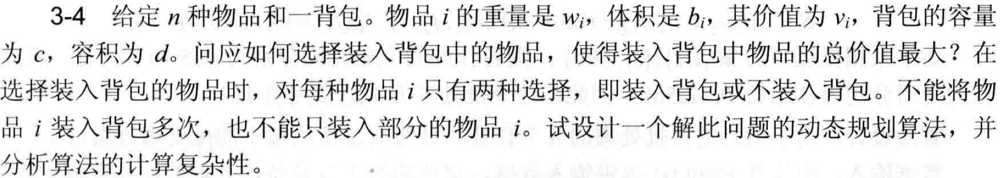

## 算法分析题3-4课堂分享

### 题目



### 解析

* 背包存在容量与体积的上限，且单个物品只有放与不放两种选择。这是经典的0-1背包问题，且属于二维背包的范畴。

* 设``dp[i][j][k]``表示背包容量为``j``容积为``k``时尝试装入前``i``个物品所装入的最大价值。对于物品``i``有装和不装两种选择。当背包的剩余容量(或容积)不足以放入物品``i``时，一定无法放入。当剩余容量(或容积)能够存放时，则需要在放入和不放入中选取最优解。

* 上述的思路转化为公式为：

$$
\begin{equation}
dp[i][j][k]
=\left\{
	\begin{array}{ll}
		dp[i-1][j][k] & j<w[i]或k<b[i],1\leqslant i \leqslant n \\
		max(dp[i-1][j][k],dp[i-1][j-w[i]][k-b[i]]+v[i]) & j\geqslant w[i]且k\geqslant b[i]
        ,1\leqslant i \leqslant n
	\end{array}\right.
\end{equation}
$$

* 观察上述公式(1)，递推过程主要发生在状态``dp[i]``与``dp[i-1]``之间。
也就是说，算法在递推过程中只涉及到第一维度的两个状态。
所以，可以考虑将第一个维度降低为常数级。
或者直接降低dp数组为二维``dp[j][k]``。

* 之前的递推更新的计算式子是：
$$
\begin{equation}
dp[i][j][k]=max(dp[i-1][j][k],dp[i-1][j-w[i]][k-b[i]]+v[i])
\end{equation}
$$

* 更新顺序：(较小的j与k生成较大的j与k)
<br>第二维度：``j-w[i] --> j``
<br>第三维度：``k-b[i] --> k``

* 假设只保留第二和第三维度，即``dp[j][k]``，那么第i次更新会将第i-1次的结果覆盖。
<br>根据上述的更新顺序，覆盖过程是由较小下标的值生成较大下标的值。
<br>因而，我们可以优先更新较大的j或k，即更新循环**由大到小**


### 实现代码

通用dp解法：$O(N^3) - O(N^3)$

```rust
fn main(){
    let n = 5;
    let c = 10;
    let d = 14;
    //dp[n+1][c+1][d+1]
    let mut dp = vec![vec![vec![0;d+1];c+1];n+1];
    let w = vec![0,1,3,5,2,3]; // 重量
    let b = vec![0,4,5,2,1,4]; // 体积
    let v = vec![0,6,3,2,1,6]; // 价值
    //dp [1,n]
    for i in 1..n+1 { // i
        for j in 1..c+1 { // j
            for k in 1..d+1 { // k
                let mut val = 0;
                if j >= w[i] && k >= b[i] {
                    val = dp[i-1][j-w[i]][k-b[i]]+v[i];
                }
                dp[i][j][k] = i32::max(dp[i-1][j][k],val);
            }
        }
    }
    println!("maxval = {}",dp[n][c][d]);
}
```

空间优化后方案：$O(N^3) - O(N^2)$

```rust
fn main(){
    let n = 5;
    let c = 10;
    let d = 14;
    //dp[c+1][d+1]
    let mut dp = vec![vec![0;d+1];c+1];
    let w = vec![0,1,3,5,2,3]; // 重量
    let b = vec![0,4,5,2,1,4]; // 体积
    let v = vec![0,6,3,2,1,6]; // 价值
    //dp [1,n]
    for i in 1..n+1 {
        for j in (0..c+1).rev() { // c -> 0
            for k in (0..d+1).rev() { // d -> 0
                if j >= w[i] && k >= b[i] {
                    dp[j][k] = i32::max(
                        dp[j][k],
                        dp[j-w[i]][k-b[i]]+v[i]
                    );
                }
            }
        }
    }
    println!("maxval = {}",dp[c][d]);
}
```


